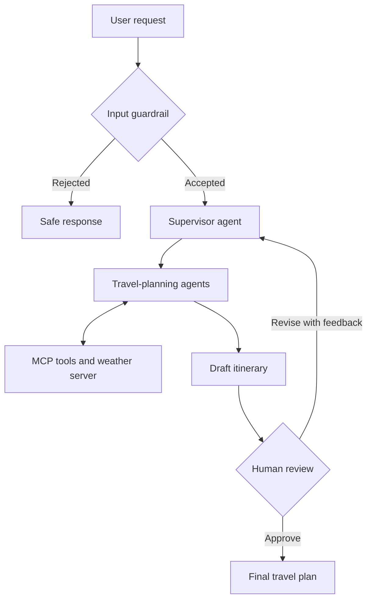

# TripMate AI

### RouteSage AI: A Safe and Intelligent Multi-Agent Travel Planning System Using LangGraph, MCP, Guardrails, and Human-in-the-Loop

[](https://www.python.org/)
[](https://fastapi.tiangolo.com/)
[](https://www.langchain.com/langgraph)
[](https://modelcontextprotocol.io/)
[](LICENSE)

TripMate AI is an end-to-end demonstration of how multiple specialized AI agents can collaborate to produce a travel plan that is useful, safe, and reviewable. Instead of allowing one model to make every decision, the system uses a **Supervisor Agent** to coordinate tasks, **guardrails** to validate requests, **MCP tools** to retrieve external information, and a **Human-in-the-Loop (HITL)** checkpoint before the final plan is accepted.

The project is designed for students, researchers, and developers who want a practical reference for building controlled agentic-AI workflows with LangGraph and FastAPI.

---

## Why this project is different

Many travel assistants generate an answer in a single step. TripMate AI uses a structured pipeline in which each stage has a clear responsibility:

- A guardrail checks whether the request is suitable for travel planning.
- A supervisor decides which agent or tool should handle each part of the task.
- Specialized components collect and organize relevant travel information.
- MCP provides a standard interface between the AI workflow and external tools.
- LangGraph maintains workflow state and supports pause/resume behavior.
- A human reviews the draft and can approve it or request changes.

This design makes the generated result easier to inspect, revise, and extend than a single uncontrolled model response.

## Core capabilities

| Capability | Purpose |
| --- | --- |
| Multi-agent orchestration | Divides a complex travel request into smaller responsibilities. |
| Supervisor agent | Selects the next action and coordinates the planning workflow. |
| Input guardrails | Rejects or redirects unsupported, unsafe, or irrelevant requests. |
| MCP integration | Connects agents to tools such as the custom weather service through a standard protocol. |
| Human approval | Pauses the workflow so a user can approve a draft or submit revision feedback. |
| Thread-based state | Preserves the planning state when a request is resumed. |
| FastAPI interface | Exposes the agent workflow through browser-friendly API endpoints. |
| Interactive frontend | Provides a simple interface for submitting prompts and reviewing results. |

## System architecture



## Human-in-the-loop workflow

1. The user submits a destination, dates, budget, interests, and other preferences.
2. Input guardrails validate the request before it reaches the planning workflow.
3. The supervisor coordinates the required agents and MCP tools.
4. The system creates a draft plan and pauses at the approval checkpoint.
5. The user either approves the draft or provides revision feedback.
6. Approved drafts become final plans; rejected drafts return to the workflow for improvement.

## Project structure

```text
.
├── app.py                          # FastAPI application and web/API routes
├── backend.py                      # LangGraph workflow and agent orchestration
├── mcp_client.py                   # Helpers for communicating with MCP tools
├── custom_weather_mcp_server.py    # Example weather MCP server
├── tools/                          # Additional agent tools and adapters
├── templates/                      # HTML templates for the web interface
├── static/                         # CSS, JavaScript, and frontend assets
├── requirements.txt                # Python dependencies
├── .gitignore                      # Files excluded from Git
├── LICENSE                         # Project license
└── README.md                       # Project documentation
```

> The exact behavior of each agent depends on the implementation and model configuration in `backend.py`.

## Technology stack

- **Python 3.10+** — application and agent logic
- **LangGraph** — stateful workflow orchestration, routing, and checkpoints
- **LangChain-compatible models/tools** — model and tool integration
- **Model Context Protocol (MCP)** — standardized communication with external tools
- **FastAPI** — backend API and web application
- **Uvicorn** — ASGI development server
- **HTML, CSS, and JavaScript** — browser interface
- **python-dotenv** — local environment-variable loading, when enabled by the application
- **nest_asyncio** — compatibility between synchronous wrappers and asynchronous helpers

## Prerequisites

Before starting, install:

- [Python 3.10 or later](https://www.python.org/downloads/)
- [Git](https://git-scm.com/downloads)
- A valid API key for the language-model provider configured in the source code

Check your installations:

```powershell
python --version
git --version
```

## Installation on Windows

### 1. Clone the repository

```powershell
git clone https://github.com/HarshMhatre23/RouteSage AI: A Safe and Intelligent Multi-Agent Travel Planning System Using LangGraph, MCP, Guardrails, and Human-in-the-Loop.git
cd RouteSage AI: A Safe and Intelligent Multi-Agent Travel Planning System Using LangGraph, MCP, Guardrails, and Human-in-the-Loop
```

### 2. Create a virtual environment

```powershell
python -m venv .venv
```

Activate it in PowerShell:

```powershell
.venv\Scripts\Activate.ps1
```

If PowerShell blocks activation, run the following command once in the current terminal and activate again:

```powershell
Set-ExecutionPolicy -Scope Process -ExecutionPolicy Bypass
.venv\Scripts\Activate.ps1
```

### 3. Install dependencies

```powershell
python -m pip install --upgrade pip
pip install -r requirements.txt
```

### 4. Configure environment variables

Create a `.env` file in the project root, beside `app.py`. Add only the variables actually read by your source code. A typical configuration looks like this:

```dotenv
# Required: use the key expected by the model configured in backend.py
OPENAI_API_KEY=your_api_key_here

# Optional: add only when the related search/tool integration is enabled
TAVILY_API_KEY=your_tavily_api_key_here
```

Important configuration notes:

- Never commit `.env` or real API keys to GitHub.
- MCP is a communication protocol; it does **not** require a universal MCP API key.
- A locally started MCP server normally uses its configured process or local URL.
- If your implementation reads an MCP server URL, use the exact variable name and address defined in `mcp_client.py`.
- API keys belong to the service being called, such as the selected LLM, search, map, flight, or weather provider.

## Run the application

The simplest setup uses two PowerShell terminals.

### Terminal 1 — start the example MCP server

```powershell
.venv\Scripts\Activate.ps1
python custom_weather_mcp_server.py
```

Keep this terminal open while the application is running. If the current workflow launches the MCP server automatically or does not use it, this step can be skipped.

### Terminal 2 — start the FastAPI application

```powershell
.venv\Scripts\Activate.ps1
uvicorn app:app --reload --host 127.0.0.1 --port 8000
```

Alternatively:

```powershell
python app.py
```

Open the application in your browser:

**http://127.0.0.1:8000**

Interactive API documentation is normally available at:

**http://127.0.0.1:8000/docs**

To stop the project, press `Ctrl + C` in each terminal. To exit the virtual environment, run:

```powershell
deactivate
```

## API reference

### Health check

```http
GET /health
```

Example:

```powershell
Invoke-RestMethod -Method Get -Uri "http://127.0.0.1:8000/health"
```

### Create or resume a travel-planning thread

```http
POST /api/travel
Content-Type: application/json
```

Request body:

```json
{
  "message": "Create a five-day budget trip from Mumbai to Goa under ₹30,000.",
  "thread_id": "optional-existing-thread-id"
}
```

PowerShell example:

```powershell
$body = @{
    message = "Create a five-day budget trip from Mumbai to Goa under ₹30,000."
} | ConvertTo-Json

Invoke-RestMethod `
    -Method Post `
    -Uri "http://127.0.0.1:8000/api/travel" `
    -ContentType "application/json" `
    -Body $body
```

Save the returned `thread_id`; it is required to approve or revise the same workflow.

### Approve a draft

```http
POST /api/travel/approve
Content-Type: application/json
```

```json
{
  "thread_id": "returned-thread-id",
  "approved": true,
  "feedback": ""
}
```

### Request a revision

```json
{
  "thread_id": "returned-thread-id",
  "approved": false,
  "feedback": "Reduce the hotel budget and add more sightseeing locations in South Goa."
}
```

## Example prompt

```text
Plan a five-day trip from Mumbai to Goa for one person with a maximum budget
of ₹30,000. Prefer train travel, budget hostels, beaches, historical places,
local food, and a relaxed schedule. Include estimated costs and a rainy-day
backup plan.
```

A high-quality result should include:

- A day-by-day itinerary
- Estimated transport, stay, food, and activity costs
- Weather-aware or practical travel notes
- Assumptions and possible limitations
- A clear approval or revision checkpoint

## Guardrails and safety

Guardrails should be treated as enforceable application logic, not merely as instructions inside a prompt. Depending on the implementation, they can be extended to check:

- Whether the request is related to travel planning
- Missing or unrealistic dates, budgets, and route details
- Unsafe, illegal, or harmful requests
- Prompt-injection attempts and suspicious tool instructions
- Sensitive personal information
- Tool permissions and allowed input formats
- Whether high-impact actions require explicit human confirmation

Human approval improves oversight, but it does not guarantee factual accuracy. Prices, schedules, entry rules, weather, and availability can change; users should verify important details with official providers before booking.

## Troubleshooting

### `python` is not recognized

Install Python and enable **Add Python to PATH**, or try the Windows launcher:

```powershell
py -m venv .venv
py -m pip install -r requirements.txt
```

### Virtual environment does not activate

```powershell
Set-ExecutionPolicy -Scope Process -ExecutionPolicy Bypass
.venv\Scripts\Activate.ps1
```

### `ModuleNotFoundError`

Confirm that the virtual environment is active, then reinstall the dependencies:

```powershell
pip install -r requirements.txt
```

### Port 8000 is already in use

Run the application on another port:

```powershell
uvicorn app:app --reload --host 127.0.0.1 --port 8001
```

Then open `http://127.0.0.1:8001`.

### MCP tool or weather server is unavailable

- Confirm that `custom_weather_mcp_server.py` is running.
- Check that the client and server use the same transport and connection settings.
- Start the MCP server before submitting a request.
- Review both terminal windows for the first error in the traceback.

### Authentication or quota error

- Confirm that `.env` is in the project root.
- Verify that the environment-variable name matches the source code exactly.
- Remove accidental quotation marks or spaces from the key.
- Check the model provider's billing, quota, and model-access settings.
- Restart the application after changing `.env`.

## Suggested future improvements

- Add live map, route, hotel, and transport providers through MCP adapters
- Add retrieval-augmented generation for destination knowledge
- Store thread and checkpoint state in a persistent database
- Add authentication and per-user trip history
- Add structured logging, tracing, and LangSmith evaluation
- Test guardrails with adversarial and prompt-injection datasets
- Add confidence scores and citations for externally retrieved facts
- Add automated tests for API routes, graph transitions, and HITL resume behavior
- Containerize the API and MCP services with Docker Compose
- Deploy the frontend and backend with secure secret management

## Research and academic value

TripMate AI can support an M.Sc.-level project by demonstrating several modern AI-engineering concepts in one working system:

- Stateful and cyclic agent workflows
- Supervisor–worker coordination
- Tool interoperability through MCP
- Safety validation before model execution
- Human oversight of AI-generated decisions
- API-based system integration
- Evaluation of correctness, safety, latency, cost, and user satisfaction

Possible evaluation metrics include guardrail precision/recall, task-completion rate, itinerary constraint satisfaction, tool-call success rate, human revision rate, response latency, token cost, and user ratings.

## Security recommendations

- Keep `.env`, credentials, logs containing secrets, and local virtual environments out of version control.
- Use least-privilege credentials for every external tool.
- Validate and sanitize all API and MCP tool inputs.
- Add request limits, timeouts, error handling, and audit logs before deployment.
- Require explicit approval before any real booking, payment, email, or external write action.

## Contributing

Contributions are welcome. To contribute:

1. Fork the repository.
2. Create a feature branch: `git checkout -b feature/your-feature`.
3. Make and test your changes.
4. Commit with a clear message.
5. Push the branch and open a pull request.

Please open an issue first for major architectural changes.

## License

This project is distributed under the terms of the [MIT License](LICENSE).

## Author

**Harsh Mhatre**

- GitHub: [@HarshMhatre23](https://github.com/HarshMhatre23)
- Repository: [RouteSage AI: A Safe and Intelligent Multi-Agent Travel Planning System Using LangGraph, MCP, Guardrails, and Human-in-the-Loop](https://github.com/HarshMhatre23/RouteSage AI: A Safe and Intelligent Multi-Agent Travel Planning System Using LangGraph,MCP, Guardrails, and Human-in-the-Loop)

---

If this project helps you understand safe multi-agent systems, consider starring the repository and sharing your feedback.
